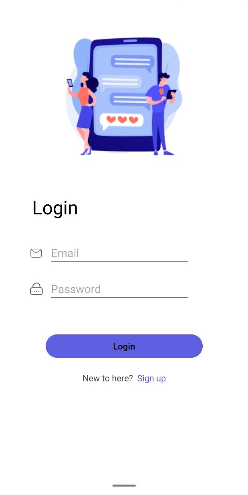
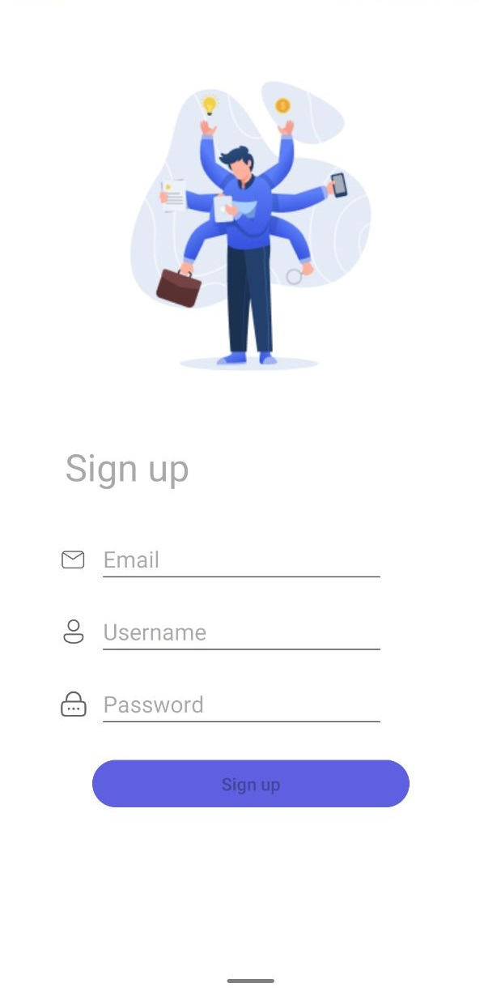
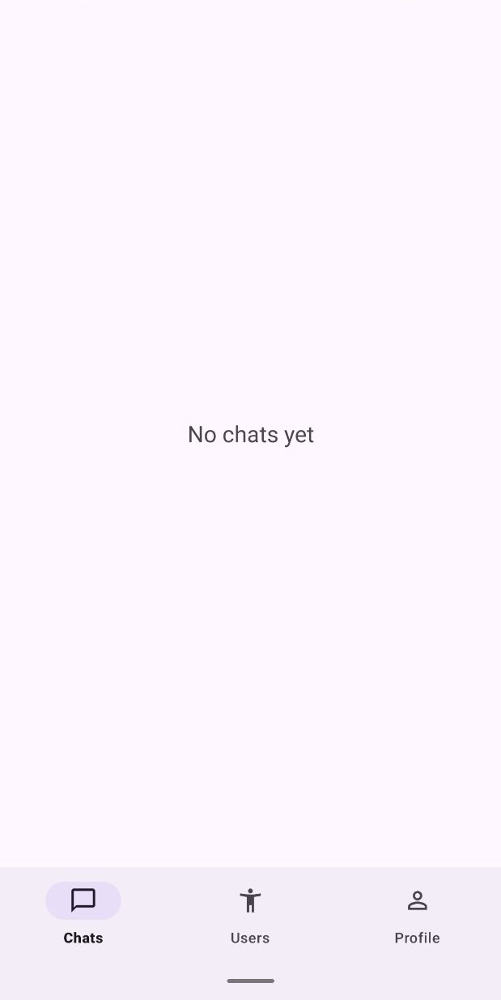
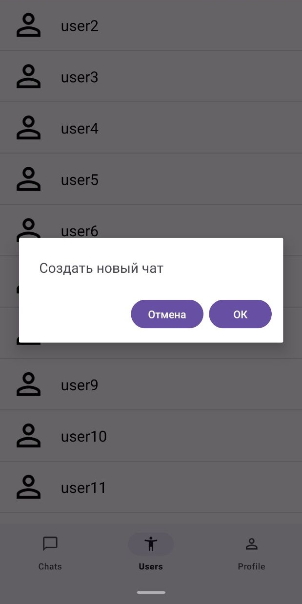
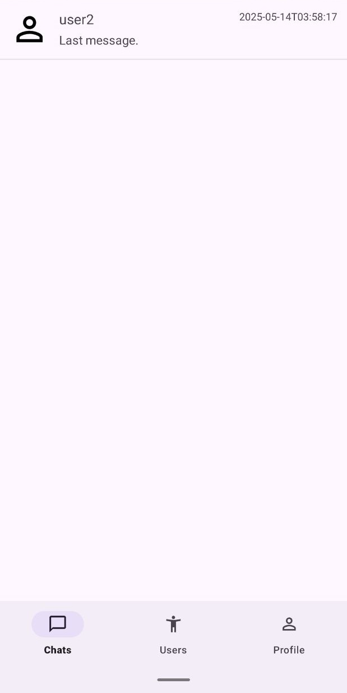
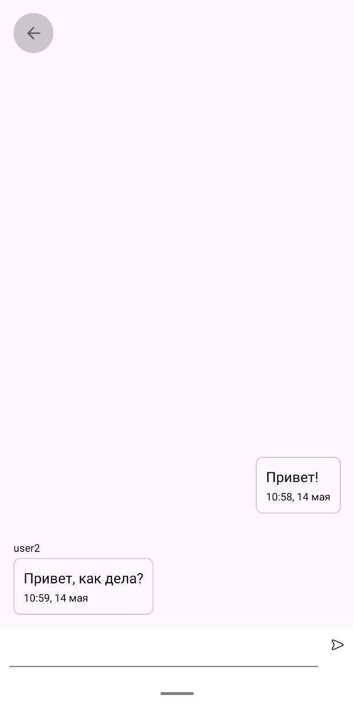

# Chat Application - Backend & Android Client
A complete chat system with a Python backend and Android app. Users can sign up, message each other, and manage conversations.

 

## Features
### Backend (Python/Flask)
- **REST API** for user accounts and messaging
- **Database abstraction layer** with dynamic table management
- **Config-driven architecture** for tables and SQL queries
- **Detailed logs** to track system activity
### Android Client
- **Login/register** system
- **Sending messages** with auto-refresh (1s delay) **bad solution :p**
- **Chat list** with active conversations
- **User search** and start new chats
- **Responsive UI** with smooth message loading
## Technology Stack
### Backend
- **Python 3** with **Flask** framework
- **MySQL** database
- **Custom ORM-like layer** for database operations
- **JSON configuration** for table schemas and queries
- **Structured logging** with timestamps and operation tracking
### Android Client
- **Java** with **Android SDK**
- **OkHttp** for server calls
- **JSON** for API communication
- **Model-View-ViewModel (MVVM)** pattern
- **RecyclerView** for message display
## Key Implementation Details
### Backend Solutions
1. **Dynamic Database Layer**:
- Tables defined in simple JSON files like
```json
{
    "create": "CREATE TABLE IF NOT EXISTS users (id INT AUTO_INCREMENT PRIMARY KEY, username VARCHAR(255) NOT NULL UNIQUE, email VARCHAR(255) NOT NULL UNIQUE, password_hash VARCHAR(255) NOT NULL, created_at TIMESTAMP DEFAULT CURRENT_TIMESTAMP);",
    "drop": "DROP TABLE IF EXISTS users;",
    "insert": "INSERT INTO users (username, email, password_hash) VALUES (%s, %s, %s);",
    "delete": {
        "by_id": "DELETE FROM users WHERE id = %s;"
    },
    "update": "UPDATE users SET username = %s, email = %s, password_hash = %s WHERE id = %s;",
    "fetch": {
        "by_id": "SELECT * FROM users WHERE id = %s;",
        "by_username": "SELECT * FROM users WHERE username = %s;",
        "by_email": "SELECT * FROM users WHERE email = %s;",
        "all": "SELECT * FROM users;",
        "all_except": "SELECT * FROM users WHERE id != %s;",
        "count": "SELECT COUNT(*) FROM users;"
    }
}
```
- Automatic query loading for each table, just specify the table in the json
```json
{
    "tables" : {
        "users": {},
        "chats": {},
        "messages": {}
    }
}
```
- Easy database access in code
```python
# Get user by ID
user = db.tables.users.fetch("by_id", "one", (user_id,))
# Send new message
new_id = db.tables.messages.insert((chat_id, sender_id, content))
```
2. **API Structure**:
- Blueprint-based route organization
- JSON request/response format
3. **Helpful Logging**:
- Separate log files for different components
- Clear success/error indicators
- Program lifecycle tracking
```log
# Example log for database
[2025-04-16 03:48:25] 🔸 Program start.
[2025-04-16 03:48:25] ✅ Database config loaded successfully.
[2025-04-16 03:48:25] ✅ Connection to database 'project-3' was successful.
[2025-04-16 03:48:25] ✅ Tables config loaded successfully.
[2025-04-16 03:48:25] ✅ Queries for table 'users' loaded successfully.
[2025-04-16 03:48:25] ✅ Table 'users' initialized with queries successfully.
[2025-04-16 03:48:25] ✅ Queries for table 'chats' loaded successfully.
[2025-04-16 03:48:25] ✅ Table 'chats' initialized with queries successfully.
[2025-04-16 03:48:25] ✅ Queries for table 'messages' loaded successfully.
[2025-04-16 03:48:25] ✅ Table 'messages' initialized with queries successfully.
[2025-04-16 03:54:04] ✅ Connection to database 'project-3' was successful close.
[2025-04-16 03:54:04] 🔸 Program end.
```
### Android Solutions
1. **Network Layer**:
- Single class handles all server HTTP communication
- UI-thread callback execution
- Animation of loading content while waiting for a response from the server
```java
// Example API call
AuthRequests.login(this, email, password, 
    (success, message, user) -> {
        // Handle response on UI thread
    });
```
2. **Messages Updates**:
- Checks for new messages every second
- Only shows new messages
- Auto-scroll to latest message

 
 
